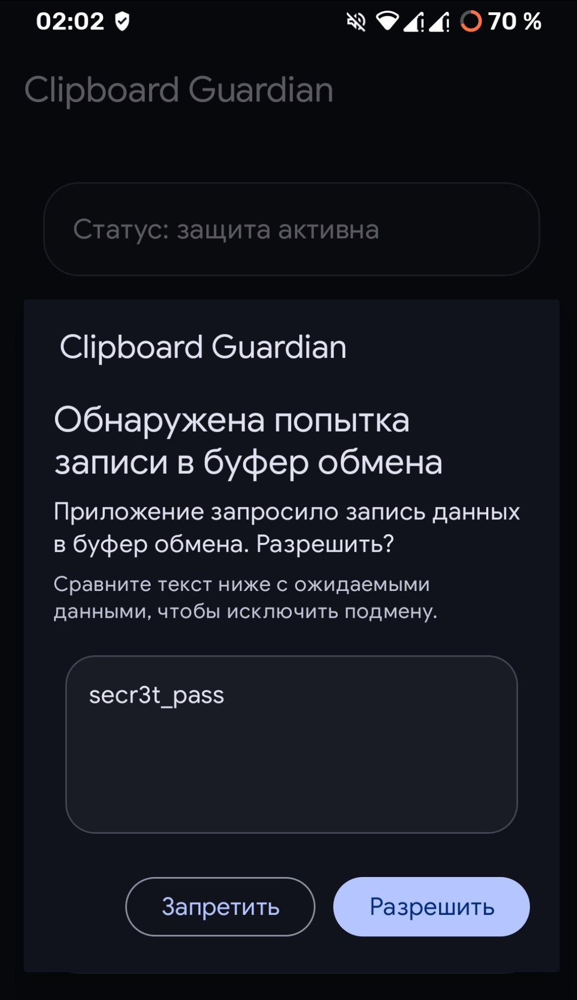
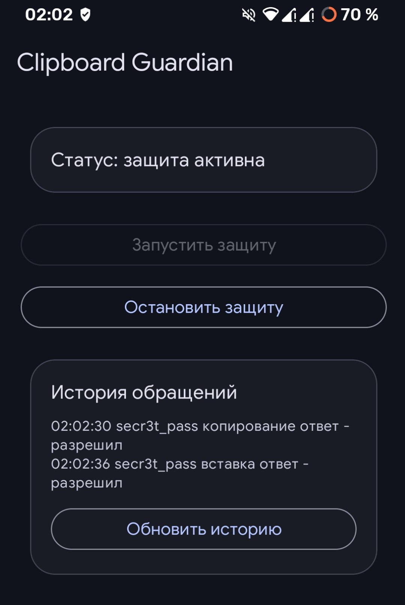
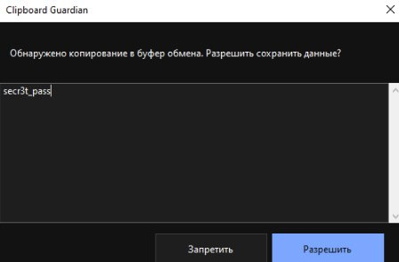
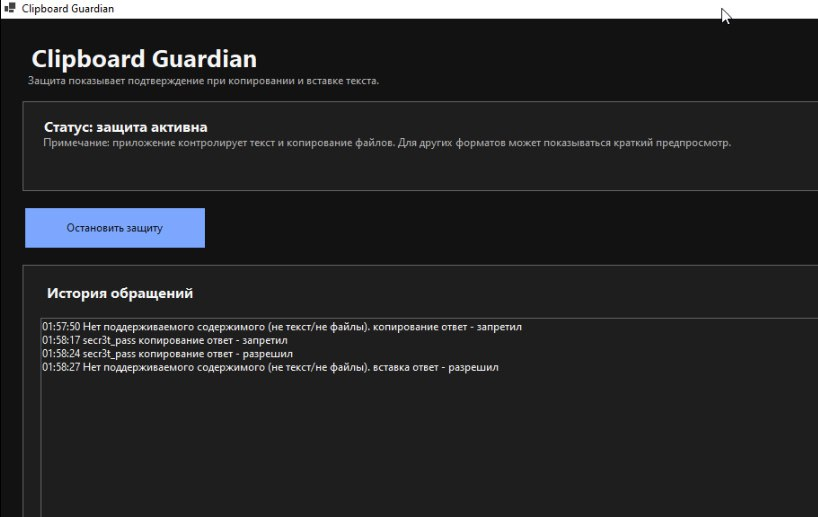

# Clipboard Guardian

Clipboard Guardian — локальный "DLP‑агент" для контроля буфера обмена на **Windows** и **Android**.
Он показывает пользователю окно "Разрешить/Запретить" при операциях с буфером и ведёт локальные логи (NDJSON).

**Windows**: отслеживает обращения к буферу через AddClipboardFormatListener и перехватывает вставку через low‑level hook.

**Android**: отслеживает обращения к буферуу, точная защита во всех приложениях возможна через Root модуль **LSPosed/Xposed** (из‑за ограничений Android 10+). Перехватывает обращения через Xposed хуки на ClipboardManager.setPrimaryClip и ClipboardManager.getPrimaryClip. 

## Быстрый старт (В Releases готовые сборки)

- **Android APK**: `ClipboardGuardian-debug.apk`
- **Windows portable EXE**: `/ClipboardGuardian.Win.exe`


## Как пользоваться

### Android: режим 1

1) Установи APK и открой приложение.  
2) Нажми “Запустить защиту”.  
3) Появится foreground‑уведомление.


### Android: режим 2 - LSPosed/Xposed (полный контроль)

1) Должны быть установлены **Magisk + LSPosed**.  
2) Установи `dist/android/ClipboardGuardian-debug.apk`.  
3) Открой **LSPosed Manager → Modules** → включи модуль **Clipboard Guardian**.  
4) Зайди в **Scope** модуля и отметь приложения (Chrome/Telegram/и т.д.).  
5) Перезапусти выбранные приложения (Force stop) или перезагрузи телефон.

Проверка: после включения Scope при попытках копирования/чтении буфера будет выводитбся окно разрешения.

### Windows: как пользоваться

1) Запусти `dist/windows/ClipboardGuardianPortable/ClipboardGuardian.Win.exe`.  
2) Откроется главное окно + иконка в трее.  
3) При копировании в буфер обмена будет появляться окно разрешения с предпросмотром текста/файлов.  
4) При попытках чтения/копирования доступ к буферу обмена будет блокироваться/разрешаться по кнопкам.

## Логи (NDJSON)

Логи пишутся в файл `logs/clipboard_log.ndjson` рядом с исполняемым файлом (Windows) или в директории приложения (Android).
NDJSON = “Newline‑Delimited JSON”: каждая строка — отдельное событие.

Пример записи: `{"timestamp":"...","action":"copy","decision":"allowed","sample":"...","note":"..."}`.

## История обращений

В обоих приложениях доступна история обращений к буферу обмена.
Формат строк: `HH:mm:ss <содержимое> <действие> ответ - разрешил/запретил`, где действие — "копирование" или "вставка".
История читается из NDJSON‑лога и обновляется кнопкой "Обновить" в главном окне.

## Структура репозитория

Архитектура приложения модульная и масштабируемая, что позволяет легко расширять функциональность.

```
android/ClipboardGuardian.Android/          – Android проект (Gradle, Kotlin)
  app/src/main/java/com/clipboardguardian/android/
    MainActivity.kt                          – главный экран (старт/стоп сервиса, статус)
    ApprovalActivity.kt                     – окно разрешения (используется сервисом и LSPosed)
    ClipboardGuardianApp.kt                 – Application (канал уведомлений, DynamicColors)
    services/
      GuardianService.kt                    – foreground service, "обычный" режим (без LSPosed)
    hooks/
      XposedInit.kt                         – Xposed entrypoint, хуки ClipboardManager
      XposedDecisionGate.kt                 – ожидание решения (broadcast + timeout)
      XposedContract.kt                     – action/extra для Xposed-broadcast
    logging/
      ClipboardLogWriter.kt                – запись событий в NDJSON
    core/models/
      ClipboardModels.kt                    – модели данных (RequestType, PendingRequest)
  app/src/main/assets/xposed_init           – список классов Xposed entrypoint

windows/ClipboardGuardian.Win/              – Windows агент (C# WinForms)
  Program.cs                                – точка входа приложения
  Core/
    Models/                                 – модели данных (ClipboardKind, ClipboardSnapshot, AccessDecision)
    Interfaces/                             – интерфейсы для расширяемости (IClipboardLogger, IClipboardLogReader)
  Services/
    ClipboardAgent.cs                      – основная логика приложения (ApplicationContext)
    ClipboardUtilities.cs                  – утилиты для работы с буфером обмена
  Hooks/
    ClipboardMonitorForm.cs                – мониторинг изменений буфера, копирования (AddClipboardFormatListener)
    KeyboardHook.cs                        – перехват обращений в буферу обмена на вставку
    NativeMethods.cs                       – P/Invoke декларации для Windows API
  UI/
    MainForm.cs                             – главное окно приложения
    AccessPromptForm.cs                     – диалог разрешения доступа
    WinTheme.cs                             – тема оформления
  Logging/
    ClipboardLogWriter.cs                   – запись событий в NDJSON
    ClipboardLogReader.cs                  – чтение истории из NDJSON

dist/                                      – готовые сборки (APK/EXE)
```

## Как собрать из исходников

### Android

Требования: Android SDK + JDK **17** (на JDK 21+ могут возникать проблемы с Android toolchain).

**Настройка Android SDK:**

1. Установи Android SDK (через Android Studio или командную строку)
2. Создай файл `android/ClipboardGuardian.Android/local.properties` с содержимым:
   ```
   sdk.dir=/path/to/android/sdk
   ```
   Или установи переменную окружения `ANDROID_HOME=/path/to/android/sdk`

**Сборка:**

```bash
cd android/ClipboardGuardian.Android
JAVA_HOME=/usr/lib/jvm/java-17-openjdk ./gradlew :app:assembleDebug --no-daemon
```

Результат: `android/ClipboardGuardian.Android/app/build/outputs/apk/debug/app-debug.apk`.

### Windows (portable EXE)

```bash
dotnet publish windows/ClipboardGuardian.Win/ClipboardGuardian.Win.csproj \
  -c Release -r win-x64 --self-contained true \
  /p:PublishSingleFile=true /p:IncludeNativeLibrariesForSelfExtract=true \
  -o dist/windows/ClipboardGuardianPortable
```
POrtable exe сборка: `dist/windows/ClipboardGuardianPortable/ClipboardGuardian.Win.exe`.
## Интерфеййсы программ

### Android

<p align="center">
  
  
</p>

### Windows

<p align="center">
  
  
</p>
